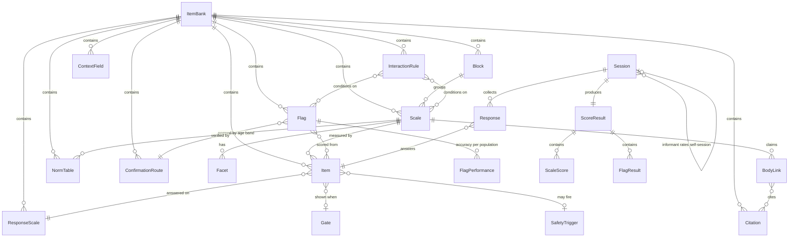

# Item bank schema

The data model for the assessment described in [../research/SPEC-v1.md](../research/SPEC-v1.md).

| File | Purpose |
|---|---|
| `types.ts` | Source of truth. TypeScript types for the bank and the response model. |
| `item-bank.schema.json` | JSON Schema (draft 2020-12) validating a serialized bank. Mirrors `types.ts`. |
| `example-bank.json` | A small filled bank exercising every construct. Validates clean. |

```bash
# validate (ajv needs the formats plugin for "date-time"/"uri")
npx ajv-cli validate --spec=draft2020 -c ajv-formats \
  -s schema/item-bank.schema.json -d schema/example-bank.json
```

## Shape



## Design decisions worth knowing

Each of these encodes a finding from the research rather than a style preference.

**Items are immutable once piloted.** `status: "piloted"` freezes wording. Changing the text means a new `id`, because psychometrics (item-total r, DIF) belong to an exact string. Retirement is recorded, not deleted, so old sessions stay interpretable.

**Every scale must declare a `BodyLink` with an `EvidenceGrade`.** `grade: "none"` is allowed and honest; omitting the field is not. Strong and moderate claims must cite something — the schema enforces it. The `verification` field is nullable on purpose: for most transmitter claims the honest answer is "nothing at the individual level would confirm this," and writing that down stops the claim from drifting.

**Flag accuracy is per population, not per flag.** `FlagPerformance` carries sensitivity, specificity *and* base prevalence, because positive predictive value is the only number that matters to a user, and it moves with base rate:

```
PPV = (sens × prev) / (sens × prev + (1 − spec) × (1 − prev))
```

Self-reported alcohol flush, at 100% sensitivity and 68% specificity, gives PPV ≈ 63% at 35% prevalence and ≈ 3% at 1%. Same question, opposite worth. `minPpvToShow` suppresses the flag rather than showing a near-worthless one, and `FlagResult.suppressedReason` records why.

**`allowNotApplicable` exists so a teetotaller isn't scored as low in alcohol reactivity.** N/A is recorded and excluded, never coerced to a low value.

**`ReportPolicy.stateSensitivity`** drives the depression caveat. Scores on state-sensitive scales get widened confidence intervals and a retake prompt when current impairment is high, because personality scores look more pathological during an episode.

**`ItemReview.culturalLoad`** is mandatory, and a `high` rating requires review notes. This is the "a sign was meant for me" problem: content that indexes religiosity rather than unusual cognition would push religious users up the most stigmatizing axis in the test. `example-bank.json` shows an item rewritten for exactly this reason.

**`InteractionRule.conditions` requires at least two conditions,** and rules are hand-written with a `rationale` and citations. With seven scales there are hundreds of combinations; anything mined from data is noise.

**`NormTable.band` requires an age range.** Traits shift with age (neuroticism down, conscientiousness up) and chronotype shifts hard (latest around age 20). Age-blind norms would mislabel the young as extreme. A norm with n < 100 must be marked `provisional`, which forces hedged copy downstream.

**`SafetyTrigger.interrupt` is the literal `true`,** so there's no way to configure a deferred crisis response.

**`Session.mode` and `targetSessionId`** support the informant module: the same items, third-person wording on the item itself, and `ScoreResult.selfInformantGaps` as the output. `informantText` becomes required at `piloted` status so the module can't be an afterthought.

**`ContextField.scored` is the constant `false`.** Context (meds, sleep, ancestry, stressors) gates items and interprets flags, but never contributes to a score. `explains` links a context field to the scales it might account for, so the report can say "your low Drive score may relate to the 5h average sleep you reported" before reaching for biology.

## Invariants the schema can't express

Enforce these in a lint step over the bank:

1. **Referential integrity** — every `scaleId`, `facetId`, `responseScaleId`, `citationId`, `copyId`, `confirmationRouteId`, `flagId` and `Condition.ref` resolves.
2. **Reverse-key balance** — each scale is within ±1 item of a 50/50 `+`/`-` split.
3. **Minimum items** — `scoring.minItemsAnswered` ≤ the number of live items on that scale.
4. **No cross-loading** — an item belongs to exactly one scale (Braverman's "I have insomnia" appeared on three).
5. **Facet belongs to its scale** — `facetId` is prefixed by `scaleId`.
6. **Response-scale fit** — `clockTime` items only on `derived` scales; `impairment` items only on the impairment scale.
7. **Gate references resolve** and are acyclic.
8. **Flag coverage** — every `Flag.performance` entry's `appliesWhen` is reachable, and some entry matches any user who can see the flag.
9. **Piloted items carry psychometrics** from at least one sample.
10. **Licence check** — no item with `origin: "licensed"` ships with `licence` containing "TO VERIFY".
11. **Copy exists** — every referenced `copyId` has both cost and upside text in the copy deck.
12. **Safety coverage** — every item whose text mentions self-harm carries a `SafetyTrigger`.

## Known placeholders in `example-bank.json`

- `flag_ferritin` scores from a sleep item because the real iron items aren't drafted yet. Its performance numbers are illustrative, not sourced.
- `c6_flush_001` is parked on the chronotype scale; it needs its own Block C scale.
- Norm tables are placeholders with `n: 0`, marked `provisional`.
- Licences on adapted items read `TO VERIFY before ship` — invariant 10 will block them.
